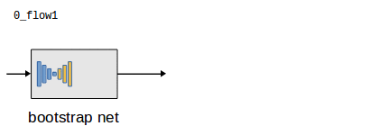

# Network Training

Code for training the network can be found in the following directories:

```
training/v2
python/depthmotionnet/v2
```

 * ```training/v2``` contains the training script ```training.py```.
 * ```python/depthmotionnet/v2``` contains the definition of the network parts for version _v2_ (```blocks.py```) and loss functions (```losses.py```) as well as code for easy instantiating of the network.


## Training Evolutions

The training process is made up of several stages called _evolutions_. 
To train DeMoN we use 6 evolutions (```0_flow1, 1_dm1, 2_flow2, 3_flow2, 4_iterative, 5_refine```).
The instantiated and actively training network parts are visualized below:



## Prerequisites

 * The python library **tfutils** for managing the training evolutions must be downloaded and added to the python path (https://github.com/lmb-freiburg/tfutils.git)
 * The ```python``` directory in the demon root is added to the python path
 * **lmbspecialops** is built and added to the python path.
 * **multivih5datareaderop** is built (see [readme](../multivih5datareaderop/README.md))
 * Training data sets are available in the folder ```datasets/training_data```. 
   The script ```datasets/download_traindata.sh``` can be used to download the data sets.


The following script sets up all required libraries from scratch in a virtualenv ```demon_venv``` managed with ```pew```:

```bash
pew new demon_venv # create new virtualenv
# the following commands are executed within the demon_venv virtualenv

# install python module dependencies
pip install tensorflow-gpu # or 'tensorflow' without gpu support
pip install pillow # for reading images
pip install matplotlib # required for visualizing depth maps
pip install Cython # required for visualizing point clouds
pip install h5py
pip install minieigen
pip install pandas
pip install scipy
pip install scikit-image
pip install xarray

# install tfutils library
git clone https://github.com/lmb-freiburg/tfutils.git
pew add $PWD/tfutils/python # add to python path

# clone demon repo with submodules
git clone --recursive https://github.com/lmb-freiburg/demon.git
DEMON_DIR=$PWD/demon
pew add $DEMON_DIR/python # add to python path

# build lmbspecialops
mkdir $DEMON_DIR/lmbspecialops/build
cd $DEMON_DIR/lmbspecialops/build
cmake .. # add '-DBUILD_WITH_CUDA=OFF' to build without gpu support
# (optional) run 'ccmake .' here to adjust settings for gpu code generation
make
pew add $DEMON_DIR/lmbspecialops/python # add to python path


# build multivih5datareaderop (requires OpenCV)
mkdir $DEMON_DIR/build 
cd $DEMON_DIR/build 
cmake ..
make

# download training data
cd $DEMON_DIR/datasets
./download_traindata.sh

```

## Training Script

```bash
cd $DEMON_DIR/training/v2
pew in demon_venv 
python training.py
```
The training script creates the folder ```$DEMON_DIR/training/v2/training```.
Once training is complete the last snapshot can be found as ```$DEMON_DIR/training/v2/training/5_refine/checkpoints/snapshot-250000.*```
   
The location of the training data can be adjusted in the file ```training.py```.

